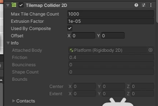
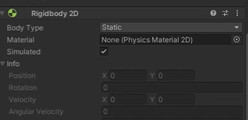
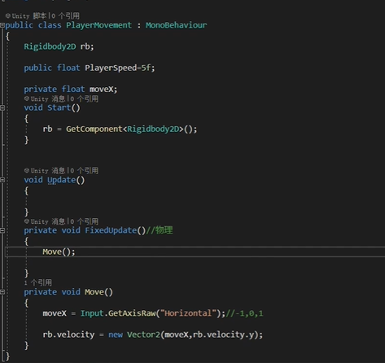
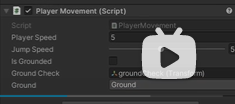
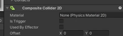

## Unity学习日志
----20221009

1. 下载安装：UnityHub/Unity2022.3(https://unity.cn/releases)
2. 个人版免费
3. 个人喜欢把窗口调成16：9\

4. 导入素材(window-asset store)
   1. 添加至我的资源
   2. 在unity中打开/window-package manager\
   
   3. 统一素材大小searchInType-Texture\
   
   4. 全选 -> Pixels Per Unit =32 -> max Size =1024 -> Compression =none -> apply
5. window - 2D - Tile Palette
6. 在原Hierarchy 窗口下create-2D Object - TileMap - Rectangular
   1. 命名为BackGround
   2. 复制一个命名为Platform\
   
7. 在Tile Palette 中可以选择active tilemap 为background
8. 在assets中创建几个文件夹（Animation/Art/Prefabs/Scripts/Tilemap)\

9. Create New Palette - background - 放在TileMap文件夹
   1. 选择background素材放进background中，存放在TileMap文件夹\
   
10. Create New Palette - platform - 放在TileMap文件夹
11. 把人物idel拖到Hierarchy
12. Create Empty - Player\

13. Player - add Component - Rigidbody 2D（刚体） - Capsule Collider 2D (碰撞体)\

14. 给平台添加碰撞 Tilemap Collider 2D\

15. 给平台设置成静止Static\

16. 给player设置点：create Empty- groundCheck - 放在脚下
17. 给player设置点：create Empty- CellingCheck - 放在头上
18. 横版移动：
    1. 创建脚本C#Scripts - PlayerMovement
    2. 把脚本赋给Player - 拖到右边即可
    3. Start()是开始的时候就调用/Update()是每帧调用一下/FixedUpdate()是物理方面的0.02s/Move()移动函数\
    4. Rigidbody2D 刚体
    5. GetComponent<?>()获取所属对象的组件
    6. Input.GetAxisRaw("Horizontal")获取x方向的数据输入，主要是AD，对应-1，0，1
    7. 而GetAxis()是-1~1，移动更丝滑
    8. Rigidbody.velocity刚体的速度
    9. rb.velocity = new Vector2(moveX*PlayerSpeed,rb.velocity.y)速度分为x,y方向的向量，所以要改变的话就是new一个向量，x的速度加上原来y的速度\
    
    10. 转向
        1. transform.localScale = new Vector3(-1,1,1);
        2. moveX放在Update()里
19. 跳跃：
    1. float jumpSpeed = 5f;
    2. bool moveJump;
    3. moveJump = Input.GetButtonDown("Jump");获取键盘输入Jump 在project Setting中的Input Manager 对应有键盘按键
    4. if(moveJump){rb.velocity  =new Vector2.up*jumpSpeed}
    5. 但这个时候是一按就跳，也就是无限多段跳，应改成当检测到在地面后才能跳
    6. bool isGrounded;
    7. Transform groundCheck;这是16创建的点
    8. LayerMask ground;一个图层
    9. isGrounded = Physics2D.OverlapCircle(groundCheck.position,0.1f,ground);通过碰撞做一个检测\
    
    10. 与墙壁的碰撞：
        1. create-2D-Physics Material 2D
        2. Finction:摩擦力 ，调成0
        3. 拖到墙壁对象的Collider2D - Material\
        
    11. 但这个时候跳跃有点飘，所以要改变重力Gravity：
        1. bool jumpHold;长按跳跃 jumpHold = Input.getButtion("Jump");
        2. float fallAddition; float jumpoAddition;下落加成，起跳加成
        3. if(rb.velocity.y<0){rb.velocity+=Vector2.up*Physics2D.Gravity.y*(fallAddition-1)*Time.fixedDeltaTime}
        4. if(rb.velocity.y>0&&!jumpHold){rb.velocity+=Vector2.up*Physics2D.Gravity.y*(jumpAddition-1)*Time.fixedDeltaTime}
20. 多段跳：
    1. int jumpCount =2 ;设定的可以跳跃次数
    2. bool isJump;
