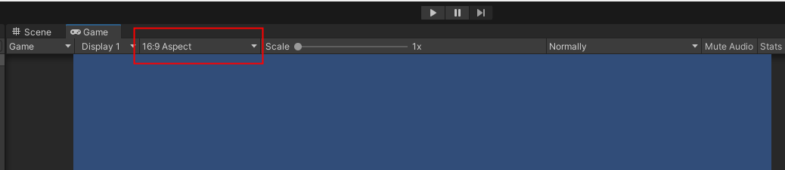

## Unity学习日志
----20221009

1. 下载安装：UnityHub/Unity2022.3(https://unity.cn/releases)
2. 个人版免费
3. 个人喜欢把窗口调成16：9

4. 导入素材(window-asset store)
   1. 添加至我的资源
   2. 在unity中打开/window-package manager
   
   3. 统一素材大小searchInType-Texture
   
   4. 全选 -> Pixels Per Unit =32 -> max Size =1024 -> Compression =none -> apply
5. window - 2D - Tile Palette
6. 在原Hierarchy 窗口下create-2D Object - TileMap - Rectangular
   1. 命名为BackGround
   2. 复制一个命名为Platform————————————————
   
7. 在Tile Palette 中可以选择active tilemap 为background
8. 在assets中创建几个文件夹（Animation/Art/Prefabs/Scripts/Tilemap）

9. Create New Palette - background - 放在TileMap文件夹
   1. 选择background素材放进background中，存放在TileMap文件夹
   
10. Create New Palette - platform - 放在TileMap文件夹
11. 把人物idel拖到Hierarchy
12. Create Empty - Player-------------------------------------------------

13. Player - add Component - Rigidbody 2D（刚体） - Capsule Collider 2D (碰撞体)

